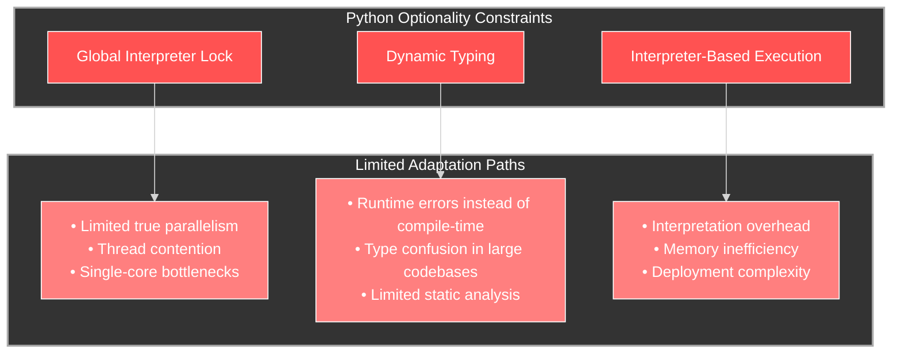
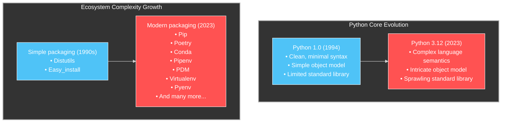

# Python's Winding Path to Antifragility: Overcoming Fundamental Limitations

## Introduction: The Paradox of Python's Success

Python has achieved unprecedented adoption across computing disciplines, from web development to scientific computing and artificial intelligence. Its success stems from genuine strengths: readability, a gentle learning curve, and an extensive ecosystem of libraries. Yet this very success has exposed fundamental limitations that prevent Python from exhibiting true antifragility—the ability to not just withstand stress but improve from it.

Python's fragilities become increasingly apparent as systems scale and performance demands grow. What began as an elegant scripting language has evolved into what many engineering teams describe as a "necessary compromise"—too deeply embedded to replace, yet fundamentally unsuited for the demands placed upon it. This article examines Python through the lens of antifragile design principles and proposes paths toward improvement that acknowledge both Python's entrenched position and its structural limitations.

## Evaluating Python Against Antifragile Design Principles

### 1. Optionality: Limited Pathways Forward

Antifragile systems maintain multiple viable adaptation paths. Python, however, suffers from constrained optionality in several critical areas:



The Global Interpreter Lock (GIL), in particular, represents a critical constraint on optionality. Despite decades of attempts to remove it, the GIL remains a fundamental limitation, forcing Python developers into suboptimal concurrency patterns like process-based parallelism with high memory overhead.

### 2. Barbell Strategy: Missing the Performance End

Antifragile systems implement Taleb's barbell strategy—combining extreme safety on one end with controlled exposure to high-impact opportunities on the other. Python excels at the safety end through readability and dynamism but fails at the performance end:

```python
# Python example with no performance barbell
def process_data(data_array):
    result = []
    for item in data_array:
        # No direct access to hardware acceleration
        # No memory layout control
        # Interpreted overhead for every operation
        processed = complex_calculation(item)
        result.append(processed)
    return result
```

This missing performance end of the barbell has led to a proliferation of workarounds:

- C/C++ extensions (which sacrifice Python's safety advantages)
- Numba/Cython (which create dual language complexity)
- GPU libraries (which introduce significant API impedance)

These workarounds represent additional complexity rather than clean barbell design.

### 3. Via Negativa: Adding Instead of Removing

The antifragile principle of via negativa suggests that systems improve by removing complexity rather than adding it. Python's evolution has moved in the opposite direction:



Python's ecosystem has responded to limitations by adding new layers rather than simplifying the core. The result is a language that has grown more complex without addressing fundamental limitations.

### 4. Skin in the Game: Misaligned Incentives

The antifragile principle of "skin in the game" requires decision-makers to bear the consequences of their choices. Python's governance model often separates those making language decisions from those experiencing the consequences:

- Library maintainers rarely feel the production impact of inefficient implementations
- Language designers may prioritize backward compatibility over addressing structural limitations
- The academic and scientific communities that drive much of Python's adoption operate on different incentives than production engineering teams

## The Path to Greater Antifragility

Despite these fundamental limitations, Python's entrenched position means it cannot simply be replaced in many organizations. Instead, a pragmatic approach to increasing Python's antifragility might include:

### 1. Diversify Execution Models with PyPy and MicroPython

Python can improve optionality by embracing alternative execution models:

```python
# Current fragile approach: Single CPython implementation
import numpy as np

def compute_intensive_calculation(data):
    # Locked into CPython's execution model and GIL
    return np.sum(data * 2)
```

A more antifragile approach would support seamless switching between execution models based on deployment context:

```python
# Antifragile approach: Multiple execution models
# Same code, different runtime selection

# For servers: PyPy with JIT compilation
# python-pypy compute_service.py

# For embedded devices: MicroPython
# micropython compute_service.py

# For performance: Leveraging language-specific optimizations
# from pypy import jit
# @jit.elidable
# def compute_intensive_calculation(data):
#     return sum(x * 2 for x in data)
```

This approach creates optionality without requiring code rewrites, allowing the same Python codebase to adapt to different execution environments.

### 2. Embrace a True Barbell Strategy with Rust Integration

Rather than compromising with halfway solutions, Python could embrace a true barbell strategy by providing first-class integration with a performance-oriented language like Rust:

```python
# Python side: High-level business logic with safety
def process_customer_data(customer_records):
    # Python handles high-level logic
    filtered_customers = [c for c in customer_records if c.is_active]
    
    # Rust handles performance-critical processing
    # with seamless memory sharing
    import customer_processing_rs
    results = customer_processing_rs.process_batch(filtered_customers)
    
    return results
```

```rust
// Rust side: Performance-critical code with safety
#[pymodule]
fn customer_processing_rs(py: Python, m: &PyModule) -> PyResult<()> {
    // Direct access to Python objects with zero-copy when possible
    #[pyfn(m)]
    fn process_batch(customers: &PyList) -> PyResult<PyList> {
        // High-performance processing in Rust
        // with full memory control and parallelism
        ...
    }
    Ok(())
}
```

This approach provides the best of both worlds: Python's readability and rapid development for high-level logic, with Rust's performance and safety for critical paths.

### 3. Via Negativa: Simplify Through Modularization

Rather than adding more features to the Python core, the language could benefit from modularization that allows users to include only what they need:

```python
# Current approach: Monolithic standard library
import json
import csv
import xml
import html
# ... and dozens more modules loaded regardless of need

# Antifragile approach: Explicit minimal imports
from python.core import (
    # Only load what's actually needed
    structures, 
    iteration
)
from python.formats import json_parser
```

This modular approach would reduce the "blast radius" of changes, allow for more focused optimization of critical components, and create a cleaner separation of concerns.

### 4. Adopt Progressive Type Verification

Python's dynamic typing creates runtime fragility. A more antifragile approach would be graduated typing that allows progressive verification:

```python
# Current approach: Optional type hints with no enforcement
def calculate_risk(customer_id: str, transactions: list[dict]) -> float:
    # Type errors only discovered at runtime
    return sum(t['amount'] for t in transactions) / len(transactions)

# Antifragile approach: Graduated enforcement levels
@enforce(level="runtime")  # Basic runtime checks
def calculate_risk_basic(customer_id: str, transactions: list[dict]) -> float:
    return sum(t['amount'] for t in transactions) / len(transactions)

@enforce(level="static")  # Compile-time verification
def calculate_risk_verified(customer_id: str, 
                           transactions: list[dict[str, float]]) -> float:
    return sum(t['amount'] for t in transactions) / len(transactions)
```

This graduated approach would allow teams to apply appropriate levels of verification based on the criticality of each component, rather than the all-or-nothing approach of current type hints.

## Emerging Community Initiatives: The Gradual Path to Antifragility

The Python community has already been moving toward antifragile design principles through its gradual typing initiatives. This evolution began with PEP 484 introduced by Guido van Rossum, Jukka Lehtosalo, and Lukasz Langa, establishing type hints as a first step toward increasing system reliability. The theoretical foundation laid out in PEP 483 explicitly embraces aspects of antifragile design by establishing the "is-consistent-with" relationship - a non-transitive relationship that creates adaptability with the introduction of the "Any" type.

More recent developments like PEP 695 and PEP 698 in Python 3.12 demonstrate the community's continued evolution toward antifragile design through enhanced typing capabilities. These PEPs introduce more expressive generic syntax and other typing features that allow developers to create code that is simultaneously flexible and robust. The gradual typing approach itself embodies antifragile principles by allowing developers to "annotate only part of a program, thus leverage desirable aspects of both dynamic and static typing" - a perfect example of barbell strategy that combines the flexibility of dynamic typing with the reliability of static typing.

These initiatives represent organic movement toward antifragile design patterns without abandoning Python's fundamental strengths. By continuing to evolve its type system while maintaining backward compatibility, Python is creating optionality and implementing a barbell strategy that allows it to adapt to increasingly complex environments while preserving its core values of readability and accessibility.

## Conclusion: Python's Antifragile Future

Python's path to antifragility doesn't require abandoning its core strengths or breaking compatibility. Instead, it requires acknowledging fundamental limitations and developing strategies that provide optionality, implement true barbell design, simplify through modularization, and align incentives across the ecosystem.

The most promising direction is not trying to make Python itself do everything, but rather creating clean, efficient interfaces between Python and complementary systems that excel where Python struggles. By embracing heterogeneity rather than monolithic design, Python can evolve toward greater antifragility while maintaining its position as a critical tool in the computing landscape.

For organizations deeply invested in Python, these approaches offer pragmatic paths forward that don't require revolutionary changes. By gradually introducing these antifragile design patterns, teams can mitigate Python's inherent fragilities while leveraging its substantial ecosystem and developer familiarity.

The future of Python isn't in pretending it can solve all problems equally well, but in acknowledging its sweet spots and limitations, then designing systems that allow it to focus on what it does best while seamlessly integrating with complementary tools for everything else.