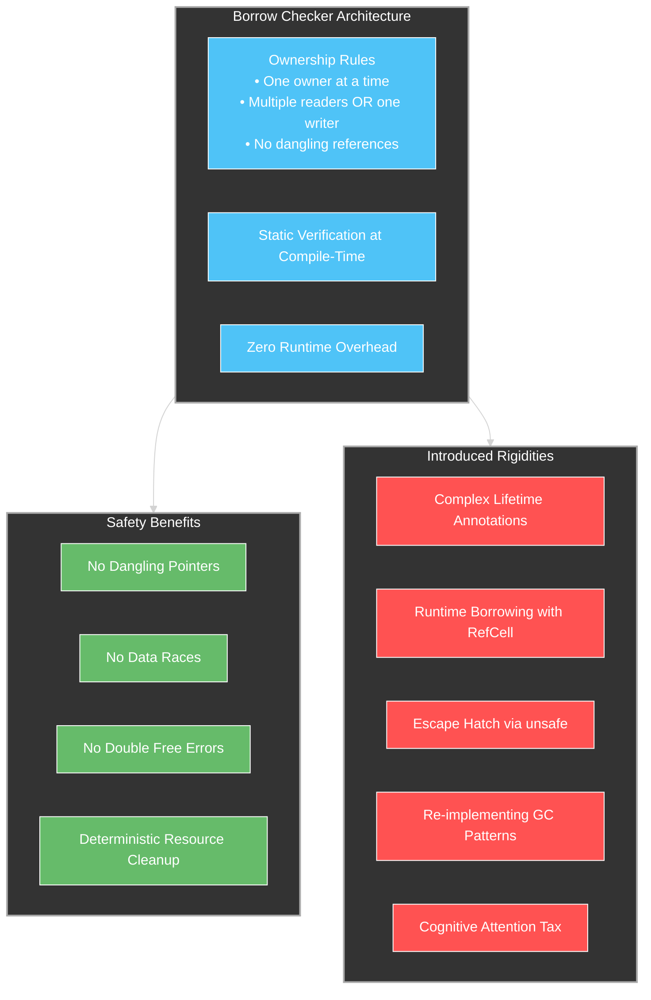

# Rust's Journey Beyond Memory Safety

## Introduction: Rust's Revolutionary Foundation

Since its introduction in 2010, Rust has fundamentally changed the landscape of systems programming. By combining memory safety without garbage collection, fearless concurrency, and zero-cost abstractions, Rust has pioneered a path that many thought impossible: making systems programming both safe and performant simultaneously. Its ownership system with borrowing and lifetimes has eliminated entire categories of bugs that have plagued C and C++ codebases for decades.

Despite these revolutionary advances, Rust's relationship with antifragile design principles remains complex. While the language excels at preventing specific forms of fragility (memory corruption, data races), it introduces other rigidities that can impede its ability to gain from disorder and volatility—the hallmark of truly antifragile systems.

This article examines Rust through the lens of Antifragile Design for Systems (AD4S), identifying both its strengths and limitations while proposing evolutionary paths that could enhance Rust's antifragility without compromising its core safety guarantees.

## Rust's Antifragile Strengths

### 1. Explicit Error Handling: Making Failure Visible

Rust's error handling system embodies antifragile principles by making failure explicit and impossible to ignore:

```rust
// Rust forces explicit handling of potential failures
fn process_data(path: &str) -> Result<Vec<u32>, std::io::Error> {
    let data = std::fs::read_to_string(path)?;
    let numbers: Vec<u32> = data
        .lines()
        .map(|line| line.parse())
        .collect::<Result<_, _>>()?;
    Ok(numbers)
}

// Usage requires explicit error handling
fn main() {
    match process_data("input.txt") {
        Ok(numbers) => println!("Processed {} numbers", numbers.len()),
        Err(e) => println!("Error: {}", e),
    }
}
```

This approach transforms error handling from an afterthought to a first-class concern, forcing developers to consider failure modes during initial development rather than discovering them in production. By making the "happy path" and "error path" equally visible in the code, Rust creates systems that are more resilient to unexpected inputs and conditions.

### 2. Cargo Ecosystem: Managed Dependency Optionality

Rust's package manager, Cargo, provides a balance of stability and optionality:

```toml
# Cargo.toml with feature flags for optionality
[dependencies]
serde = { version = "1.0", features = ["derive"] }
tokio = { version = "1", features = ["full"] }
log = "0.4"

# Development-only dependencies
[dev-dependencies]
criterion = "0.5"
mockall = "0.11"

# Conditional compilation based on target
[target.'cfg(target_os = "linux")'.dependencies]
libc = "0.2"
```

This approach allows:
- Precise versioning for reproducible builds
- Feature flags for optional capabilities
- Target-specific dependencies
- Separation of production and development dependencies

These capabilities create controlled optionality, allowing developers to adapt their dependencies to different environments and requirements without sacrificing reproducibility.

### 3. Transparent Optimizer Behavior

Rust's commitment to zero-cost abstractions and predictable performance aligns with antifragile principles by making performance characteristics explicit rather than opaque:

```rust
// Rust's performance model is explicit and transparent
#[inline(always)]
fn performance_critical_function(value: u32) -> u32 {
    // Compiler guarantees this will be inlined
    value * 2
}

// Regular function may or may not be inlined based on optimizer
fn regular_function(value: u32) -> u32 {
    value * 2
}
```

This transparency allows developers to understand and predict how their code will perform, creating systems that remain robust under varying performance conditions rather than experiencing sudden, unexpected performance cliffs.

## Rust's Fragilities and Limitations

Despite these strengths, Rust exhibits several characteristics that limit its antifragility.

### 1. The Borrow Checker: Cognitive Handcuffs on Optionality

Rust's borrow checker is simultaneously its greatest innovation and its most significant source of rigidity. It functions as a form of "handcuffs" on optionality, not because of technical limitations, but because of the disproportionate cognitive overhead it imposes relative to the actual problem domain:



While the borrow checker eliminates memory safety issues, it imposes a rigid mental model that can be at odds with certain problem domains. More importantly, it demands a disproportionate amount of developer attention, creating what might be called a "cognitive tax" on development:

1. **Attention Misallocation**: Developers often spend more mental energy satisfying the borrow checker than solving their actual domain problems

2. **Constrained Design Space**: The borrow checker forces developers to structure code in ways that satisfy ownership rules, regardless of whether those structures are natural to the problem domain

3. **Forced Indirection**: Many elegant solutions must be abandoned in favor of more convoluted approaches that appease the borrow checker

```rust
// Fighting the borrow checker for a simple graph structure
struct Node {
    edges: Vec<usize>,  // Indices rather than references
    data: String,
}

struct Graph {
    nodes: Vec<Node>,
}

impl Graph {
    // Complex code needed for simple graph traversal
    fn traverse(&self, start: usize) {
        let mut visited = vec![false; self.nodes.len()];
        self.traverse_recursive(start, &mut visited);
    }
    
    fn traverse_recursive(&self, current: usize, visited: &mut [bool]) {
        if visited[current] {
            return;
        }
        
        visited[current] = true;
        println!("Visiting: {}", self.nodes[current].data);
        
        for &edge in &self.nodes[current].edges {
            self.traverse_recursive(edge, visited);
        }
    }
}
```

This example demonstrates how Rust's ownership model forces artificial indirection (using indices instead of references) for graph structures, resulting in code that's less intuitive and potentially less efficient than equivalent code in garbage-collected languages. 

The cognitive overhead here isn't merely an inconvenience—it's a fundamental constraint on optionality. When developers must constantly contend with ownership rules that fight against the natural structure of their problem domain, they experience a form of decision fatigue that limits creative problem-solving. This fatigue represents an invisible cost that's rarely accounted for in evaluations of Rust's benefits:

```rust
// Example: Cognitive overhead of working with a simple cache
struct Cache {
    data: HashMap<String, Vec<u8>>,
}

impl Cache {
    // Function that fights the borrow checker despite simple intent
    fn get_or_insert(&mut self, key: String, generator: impl FnOnce() -> Vec<u8>) -> &Vec<u8> {
        if !self.data.contains_key(&key) {
            let value = generator();
            self.data.insert(key.clone(), value);
        }
        
        // Error: cannot borrow `self.data` as immutable because it is also borrowed as mutable
        // self.data.get(&key).unwrap()
        
        // Workaround: use ugly, non-intuitive pattern that pleases the borrow checker
        match self.data.get(&key) {
            Some(value) => value,
            None => unreachable!(), // We just inserted it!
        }
    }
}
```

In this example, the developer's natural intuition is thwarted by the borrow checker, forcing them to adopt a pattern that is less readable and more error-prone, despite the underlying logic being straightforward. These handcuffs on natural expression represent a substantial limitation for antifragile design, as they constrain the system's ability to adapt to unforeseen challenges.

### 2. Unsafe as Binary Switch: Missing the Barbell

Rust's `unsafe` keyword operates as a binary switch—code is either completely safe or completely unsafe. This approach misses the opportunity for a more nuanced barbell strategy:

```rust
// Current approach: Binary safe/unsafe switch
fn process_buffer(buffer: &mut [u8]) {
    // Safe code with full borrow checker constraints
    for byte in buffer.iter_mut() {
        *byte = byte.wrapping_add(1);
    }
}

// Unsafe code bypasses all borrow checker constraints
unsafe fn process_buffer_unchecked(ptr: *mut u8, len: usize) {
    // No safety guarantees at all
    for i in 0..len {
        *ptr.add(i) = (*ptr.add(i)).wrapping_add(1);
    }
}
```

The absence of gradations between "fully safe" and "completely unsafe" creates a false dichotomy that doesn't align with real-world safety needs, where different components may need different safety guarantees.

### 3. Monolithic Compiler: Limited Adaptation Paths

Rust's single-implementation approach creates a bottleneck for language evolution and adaptation:


This monolithic approach limits optionality and creates a single point of failure for the entire ecosystem. Unlike languages with multiple implementations (e.g., C, C++, JavaScript), Rust's ecosystem depends entirely on the official compiler, creating a bottleneck for adaptation and experimentation.

## Paths to Enhanced Antifragility

To enhance Rust's antifragility without compromising its core strengths, we propose several evolutionary paths:

### 1. Graduated Memory Management: Unlocking the Ownership Handcuffs

To move beyond the cognitive handcuffs of its current ownership model, Rust could evolve to support multiple memory management strategies based on context and requirements:

```rust
// Conceptual syntax for graduated memory management
#[memory_model(ownership)]  // Current ownership model
fn standard_function(data: Vec<u32>) -> Vec<u32> {
    // Standard Rust ownership rules apply
    data.iter().map(|x| x * 2).collect()
}

#[memory_model(regions)]  // Region-based memory management
fn region_based_function() -> Vec<u32> {
    // Simplified ownership for certain scenarios
    // Memory allocated in this function's region
    // Automatically freed when region is exited
    let mut result = Vec::new();
    for i in 0..100 {
        let temp = vec![i, i+1, i+2];  // Allocated in region
        result.push(temp[0]);  // No move semantics needed
    }  // temp automatically freed, but no double-free issues
    result
}

#[memory_model(gc)]  // Opt-in garbage collection
fn graph_algorithm() {
    // GC-managed memory for complex linked data structures
    struct Node {
        edges: Vec<Gc<Node>>,  // Direct references
        data: String,
    }
    
    // Simplified graph traversal with direct references
    fn traverse(node: &Gc<Node>, visited: &mut HashSet<usize>) {
        let id = node.as_ptr() as usize;
        if !visited.insert(id) {
            return;
        }
        
        println!("Visiting: {}", node.data);
        for edge in &node.edges {
            traverse(edge, visited);
        }
    }
}
```

This graduated approach would preserve Rust's core ownership model while providing alternative memory management strategies for specific scenarios where the standard ownership model creates unnecessary complexity.

### 2. Implement a True Barbell Strategy for Safety

Instead of the binary safe/unsafe switch, Rust could adopt a more nuanced barbell strategy with multiple safety levels:

```rust
// Conceptual barbell approach to safety
// Safe by default - full borrow checker guarantees
fn regular_function(vec: &mut Vec<u32>) {
    vec.push(42);
}

// Unsafe with specific guarantees
#[unsafe_with(guarantees="bounds_checked")]
fn partially_unsafe_function(vec: &mut Vec<u32>, idx: usize) {
    // Bounds are still checked, but other safety
    // constraints might be relaxed
    if idx < vec.len() {  // Bounds check preserved
        let ptr = vec.as_mut_ptr();
        unsafe {
            // Direct memory access but with bounds guarantee
            *ptr.add(idx) = 42;
        }
    }
}

// Fully unsafe - no guarantees
unsafe fn completely_unsafe_function(ptr: *mut u32, len: usize) {
    // No safety guarantees at all
    for i in 0..len {
        *ptr.add(i) = 42;
    }
}
```

This approach would allow more nuanced safety trade-offs, enabling developers to precisely specify which safety guarantees they need for each context rather than forcing an all-or-nothing choice.

### 3. Create Multiple Implementation Options Through MLIR

To increase optionality and adaptation potential, Rust could adopt MLIR as an intermediate representation, enabling multiple compilation backends:


This architectural approach would:
- Preserve the core Rust language semantics
- Enable multiple compilation backends for different scenarios
- Allow specialized optimizations for specific target environments
- Create a cleaner separation between language semantics and implementation details
- Open the door to alternative implementations and experimentation

### 4. Via Negativa: Simplify Instead of Adding Features

Rust could benefit from applying the via negativa principle—improving through subtraction rather than addition:

```rust
// Current trend: Adding complexity through new features
// Const generics, GATs, async/await, etc.

// Alternative: Simplify and focus on ergonomics
// Example: Simplified error handling
fn current_approach() -> Result<(), Box<dyn std::error::Error>> {
    let file = std::fs::File::open("input.txt")?;
    let reader = std::io::BufReader::new(file);
    // Complex chain of operations with error propagation
    Ok(())
}

// Hypothetical simplified approach
fn simplified_approach() -> std::io::Result<()> {
    // Simplified API surface with fewer concepts
    // but equivalent safety guarantees
    for line in std::fs::read_lines("input.txt")? {
        // Process line
    }
    Ok(())
}
```

This approach would focus on simplifying Rust's existing capabilities rather than constantly adding new features, potentially reducing the cognitive load while maintaining the same safety guarantees.

### 5. Community Dialect Experimentation

To encourage controlled innovation without destabilizing the core language, Rust could adopt a dialect approach:

```rust
// Core Rust remains stable and predictable
fn standard_function(x: u32) -> u32 {
    x * 2
}

// Dialect-specific extensions for experimentation
#[dialect(data_oriented)]
fn specialized_function(data: &[u32]) -> Vec<u32> {
    // Dialect-specific features and optimizations
    data.par_chunk_map(64, |chunk| {
        chunk.iter().map(|x| x * 2).collect()
    }).flatten().collect()
}

// Different dialect for embedded systems
#[dialect(embedded)]
fn no_alloc_function(input: &[u32], output: &mut [u32]) {
    // Dialect guarantees no heap allocation
    for (i, &val) in input.iter().enumerate() {
        if i < output.len() {
            output[i] = val * 2;
        }
    }
}
```

This approach would:
- Keep the core language stable and predictable
- Allow experimentation in controlled contexts
- Enable domain-specific optimizations and features
- Provide clear expectations about feature stability
- Create innovation pathways without disrupting existing code

## Conclusion: Rust's Antifragile Future

Rust has already revolutionized systems programming by delivering memory safety without garbage collection. Its next frontier is to evolve from a robust language (one that resists stressors) to a truly antifragile one (one that improves from exposure to stressors).

The paths outlined in this article—graduated memory management, nuanced safety barbells, multiple implementation options, simplification, and dialect experimentation—represent viable evolutionary directions that preserve Rust's core strengths while enhancing its adaptability to an uncertain future.

By embracing these antifragile design principles, Rust can continue its trajectory as a transformative systems programming language, not only eliminating specific categories of bugs but creating a truly adaptive foundation for the next generation of software systems. The result would be a language that maintains its revolutionary safety guarantees while gaining the flexibility to thrive in diverse and changing environments—the hallmark of true antifragility.

Rust's journey from safety to antifragility represents not just an evolution of a programming language but a broader shift in how we think about systems design. By recognizing both Rust's revolutionary contributions and its current limitations, we can chart a path toward systems that are not merely safe or robust, but truly antifragile—gaining from the disorder and volatility that characterize our complex computing landscape.