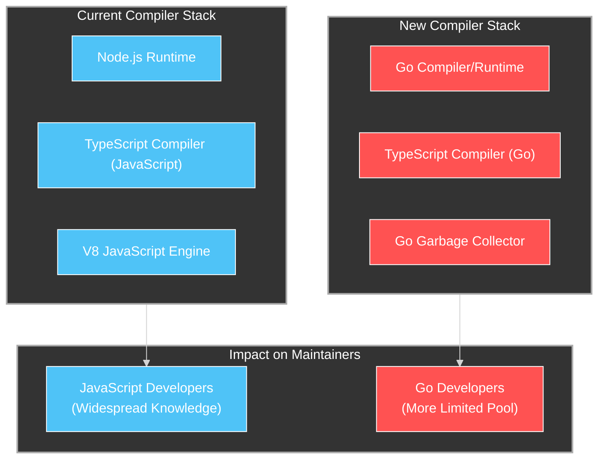
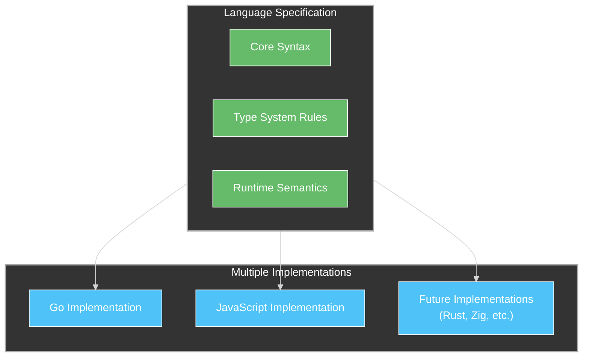

# TypeScript's Antifragile Evolution: Navigating the Go Compiler Transition

## Introduction: TypeScript at a Crossroads

TypeScript stands at a pivotal moment in its evolution. Since its introduction in 2012, Microsoft's typed superset of JavaScript has grown from an experimental language to the backbone of modern web development. TypeScript's unique position, providing static typing that compiles to JavaScript, has created a powerful barbell strategy that combines the safety of static typing with the universal deployment capability of JavaScript.

The announcement that TypeScript is transitioning its compiler from JavaScript to Go represents a significant architectural shift. This decision, while offering potential performance and maintainability benefits, raises important questions about TypeScript's alignment with antifragile design principles. As the language evolves, will this change enhance TypeScript's antifragility, or will it introduce new rigidities and dependencies that could undermine the language's adaptability in an uncertain future?

This article examines TypeScript through the lens of Antifragile Design for Systems (AD4S), evaluating its current strengths and vulnerabilities while providing specific recommendations for maintaining and enhancing its antifragile characteristics during this transition.

## TypeScript's Current Antifragile Characteristics

TypeScript has naturally incorporated several antifragile design principles that have contributed to its success:

### 1. Optionality Through Gradual Typing

TypeScript embraces optionality by allowing developers to apply static typing progressively:

```typescript
// Fully dynamic - like JavaScript
function processData(data) {
  return data.map(item => item.value * 2);
}

// Partially typed - increased safety where needed
function processItems(data: any[]): number[] {
  return data.map(item => item.value * 2);
}

// Fully typed - maximum static verification
function processItems(data: Array<{value: number}>): number[] {
  return data.map(item => item.value * 2);
}
```

This graduated approach creates optionality for developers, who can apply different levels of type safety to different parts of an application based on their needs and constraints. It enables a smooth migration path from JavaScript to TypeScript and allows teams to prioritize type safety in critical areas while maintaining flexibility elsewhere.

### 2. Barbell Strategy: Safety and Compatibility

TypeScript implements a barbell strategy with static typing for safety on one end and JavaScript compatibility for universal deployment on the other:


This barbell approach gives developers the best of both worlds: the safety and tooling benefits of static typing during development, with the universal deployment capability of JavaScript at runtime.

### 3. Skin in the Game: Microsoft's Commitment

TypeScript's development is driven by Microsoft, which has significant "skin in the game", the language powers Microsoft's own large-scale codebases like Visual Studio Code and Microsoft Office Online. This alignment creates a positive feedback loop where the language evolves to solve real-world problems rather than theoretical concerns.

## Potential Fragilities in the Go Compiler Transition

The transition to a Go-based compiler introduces potential fragilities that must be carefully managed:

### 1. Increased Dependency Chain and Build Complexity

Moving from JavaScript to Go for the compiler introduces a new dependency and more complex build requirements:



This transition means that TypeScript developers and contributors will need to understand Go to contribute to the compiler, potentially narrowing the contributor pool and increasing the knowledge barriers to participation.

### 2. Cultural Misalignment Between TypeScript and Go

TypeScript and Go represent different programming paradigms with different approaches to type systems:

- TypeScript embraces structural typing, generics, and complex type relationships
- Go prefers nominal typing, simplicity, and concrete types over complex abstractions

This cultural misalignment could create friction in the compiler implementation, potentially leading to design decisions that don't align with TypeScript's philosophy.

### 3. Loss of Self-Hosting Benefits

Currently, TypeScript is largely self-hosted, meaning the compiler is written in TypeScript itself. This self-hosting provides several benefits:

- It serves as a real-world test case for the language
- It ensures language designers experience the pain points firsthand
- It creates a virtuous feedback loop for language improvement

Moving to Go disrupts this feedback loop and removes the "skin in the game" aspect of the current self-hosted approach.

## Recommendations for Enhanced Antifragility

To maintain and enhance TypeScript's antifragile characteristics during and after the transition to Go, we recommend the following strategies:

### 1. Maintain Multiple Compiler Implementations

Instead of viewing the Go compiler as a replacement, TypeScript should maintain multiple compiler implementations as a form of optionality:

```typescript
// Configuration-based compiler selection
{
  "compilerOptions": {
    "implementation": "go", // or "js" or "native"
    // Implementation-specific options
    "go": {
      "parallelism": true,
      "memoryLimit": "4GB"
    },
    "js": {
      "useWorkerThreads": true
    }
  }
}
```

This approach would:
- Preserve optionality for users with different needs
- Create healthy competition between implementations
- Provide fallback options if one implementation encounters issues
- Allow gradual adoption of the Go compiler without forcing a hard transition

### 2. Extract Core Language Specification for Implementation Independence

To ensure that the language definition remains independent of any specific implementation, TypeScript should formalize its specification separate from the compiler code:



This separation would:
- Ensure the language evolution is driven by design principles rather than implementation details
- Allow multiple implementations to conform to the same specification
- Create a formal verification mechanism to confirm implementation correctness

### 3. Implement a Barbell Approach to Compiler Architecture

Apply the barbell strategy to the compiler architecture itself, combining a stable core with experimental type system features:

```typescript
// Type system experimentation with stability guarantees
// @experimental namespace isolates cutting-edge features
namespace @experimental {
  // Advanced type system features can evolve rapidly
  // without destabilizing the core language
  type DeepPartial<T> = T extends object 
    ? { [P in keyof T]?: DeepPartial<T[P]> } 
    : T;
}

// Core language remains stable and predictable
interface User {
  id: number;
  name: string;
}

// Opt-in to experimental features when needed
type PartialUser = @experimental.DeepPartial<User>;
```

This approach would:
- Provide stability guarantees for core language features
- Allow experimentation and innovation in isolated areas
- Create clear expectations for feature stability
- Support incremental adoption of new capabilities

### 4. Embrace "Via Negativa" for the Type System

As TypeScript's type system has grown increasingly complex, consider applying the "via negativa" principle by simplifying rather than adding more features:

```typescript
// Current approach: Complex intersections of conditional types
type ComplexType<T> = T extends Array<infer U> 
  ? U extends object 
    ? { [K in keyof U]: U[K] extends Function ? U[K] : never }
    : never
  : never;

// Simplified approach: Clear, composable type operations
// that combine through simple, predictable rules
type ArrayElement<T> = T extends Array<infer U> ? U : never;
type ObjectKeysOfType<T, ValueType> = {
  [K in keyof T as T[K] extends ValueType ? K : never]: T[K]
};

// Usage: More readable composition
type FunctionKeys<T> = ObjectKeysOfType<T, Function>;
type ArrayFunctionKeys<T> = FunctionKeys<ArrayElement<T>>;
```

This simplification would:
- Make the type system more approachable for newcomers
- Reduce the cognitive load for all developers
- Improve type checking performance through simpler rules
- Create more predictable compiler behavior

### 5. Preserve Structural Typing Against Go's Nominal Bias

Go's nominal type system could subtly influence TypeScript's structural type system during the compiler transition. The language should explicitly preserve structural typing as a core principle:

```typescript
// TypeScript's powerful structural typing
interface Named {
  name: string;
}

// Any object with a name property satisfies this interface
function greet(person: Named): string {
  return `Hello, ${person.name}!`;
}

// These both work through structural compatibility
greet({ name: "Alice", age: 30 });  // Works
greet({ name: "Bob", id: 123 });    // Works
```

To preserve this:
- Document structural typing as a core language principle
- Create test suites specifically for structural typing cases
- Review Go compiler code for subtle shifts toward nominal typing patterns
- Establish formal verification for structural typing compliance

## Emerging Community Initiatives: Antifragile Design in Practice

The TypeScript team's approach to the Go compiler transition implicitly incorporates antifragile design principles while not explicitly labeling them as such. Microsoft's stated design goals for TypeScript reflect several key antifragile principles, including a commitment to ensuring that the language "preserves runtime behavior of all JavaScript code" and "imposes no runtime overhead on emitted programs." These principles fundamentally align with the AD4S concept of maintaining optionality.

Particularly notable in TypeScript's design approach is the principle that the language should never "add or rely on run-time type information in programs, or emit different code based on the results of the type system." As explained in TypeScript's documentation, "as a principle, TypeScript never changes the runtime behavior of JavaScript code." This commitment ensures that code can move freely between JavaScript and TypeScript environments, creating a truly antifragile boundary that enables gradual adoption and adaptation to changing requirements.

The TypeScript community has also begun adopting utility types such as `Required<T>`, `Partial<T>`, `Readonly<T>`, and `NonNullable<T>` that effectively implement barbell strategies by allowing developers to precisely control type constraints in different contexts. These patterns allow a system to be both flexible and rigid in carefully chosen ways, a hallmark of antifragile design.

These community-driven patterns demonstrate how TypeScript is naturally evolving toward greater antifragility, even as it undergoes significant architectural changes like the Go compiler transition.

## Conclusion: Maintaining Antifragility Through Transition

TypeScript's move to a Go-based compiler offers potential benefits in performance and maintainability, but it must be carefully managed to preserve the language's existing antifragile characteristics. By maintaining multiple compiler implementations, formalizing the language specification, adopting a barbell approach to language evolution, simplifying the type system, and preserving structural typing, TypeScript can navigate this transition while enhancing rather than diminishing its antifragility.

The true test of an antifragile system is not how it performs during stability, but how it adapts to and improves from stress and change. This compiler transition represents just such a stress test. By applying antifragile design principles to the transition itself, TypeScript can emerge stronger, with greater optionality, clearer separation of concerns, and more robust implementation strategies.

For the broader TypeScript ecosystem and community, this transition offers an opportunity to reevaluate assumptions and design choices that have accumulated over a decade of growth. The principles of antifragile design, optionality, barbell strategy, via negativa, and skin in the game, can provide a powerful framework for guiding this evolution toward a TypeScript that remains relevant and adaptable in an uncertain future.
