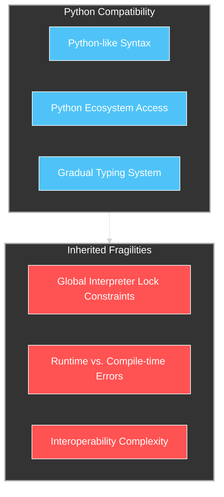
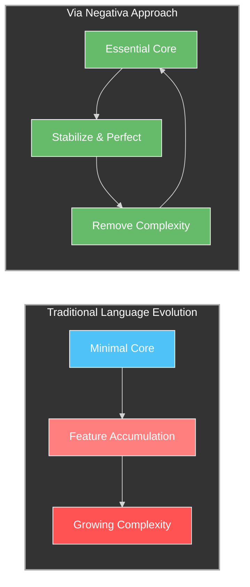

# Mojo's Antifragile Opportunity: Avoiding the Pitfalls of Its Predecessors

## Introduction: A New Language at a Critical Juncture

Mojo has emerged as an ambitious attempt to bridge the gap between Python's ease of use and the performance demands of modern computing. Positioning itself as "Python with superpowers," Mojo aims to provide Python-like syntax with systems-level performance, memory safety guarantees, and first-class support for heterogeneous computing. As a new language designed in the 2020s, Mojo has the unique opportunity to learn from decades of language evolution and integrate antifragile design principles from the ground up.

However, by attempting to merge Python's dynamic approach with Rust's performance and safety guarantees, Mojo risks inheriting fundamental limitations from both languages rather than their strengths. This article examines Mojo through the lens of Antifragile Design for Systems (AD4S), identifying potential fragilities and recommending paths toward a truly antifragile design that transcends, rather than combines, the limitations of its predecessors.

## Mojo's Current Trajectory: Inheriting Fragilities

### 1. Python Compatibility: The Double-Edged Sword

Mojo's commitment to Python compatibility creates an immediate tension with antifragile design principles:



By prioritizing Python compatibility, Mojo inherits Python's fundamental architectural limitations:

```python
# Mojo code inheriting Python's fragilities
fn sequential_task():
    # GIL contention if compiled for Python compatibility
    for i in range(1000):
        # Dynamic type checking at runtime
        process_item(i)

fn parallel_task[T: AnyType](data: List[T]):
    # No clear memory ownership model
    # Potentially runtime type errors despite type parameter
    for item in data:
        process_in_parallel(item)
```

This compatibility focus conflicts with the antifragile principle of optionality, by binding itself to Python's evolution and limitations, Mojo reduces its adaptation potential rather than maximizing it.

### 2. Rust-Inspired Ownership Without Rust's Compiler Guarantees

While Mojo draws inspiration from Rust's memory management approach, it lacks Rust's rigorous compile-time guarantees:

```python
# Mojo's partial adoption of Rust concepts
fn ownership_example():
    # Ownership-like concepts but without Rust's borrow checker
    var data = Array[Int](100)
    
    # No compile-time guarantee against use-after-move
    process_data(data)
    
    # Might cause runtime error or undefined behavior
    # unlike Rust which would catch this at compile time
    print(data[0])  
```

This halfway approach presents the worst of both worlds: the cognitive overhead of ownership concepts without the strong safety guarantees that justify that overhead in Rust.

### 3. Conflicting Memory Management Models

Mojo attempts to span multiple memory management paradigms, creating potential confusion and inconsistency:

```mermaid
%%{init: {'theme': 'dark', 'themeVariables': { 'primaryColor': '#242424', 'primaryTextColor': '#fff', 'primaryBorderColor': '#888', 'lineColor': '#d3d3d3', 'secondaryColor': '#2b2b2b', 'tertiaryColor': '#333' }}}%%
flowchart LR
    subgraph MemoryModels["Conflicting Memory Models"]
        Python["Python Reference Counting + GC"]
        Ownership["Rust-inspired Ownership"]
        Manual["Manual Memory Management"]
    end
    
    subgraph Consequences["Mixed Model Consequences"]
        Confusion["Developer Confusion"]
        Leaks["Hybrid Memory Leaks"]
        Complexity["Mental Model Complexity"]
    end
    
    MemoryModels --> Consequences
    
    style MemoryModels fill:#333,stroke:#aaa,stroke-width:2px,color:#fff
    style Consequences fill:#333,stroke:#aaa,stroke-width:2px,color:#fff
    style Python fill:#FF5252,stroke:#fff,stroke-width:1px,color:#fff
    style Ownership fill:#FF5252,stroke:#fff,stroke-width:1px,color:#fff
    style Manual fill:#FF5252,stroke:#fff,stroke-width:1px,color:#fff
    style Confusion fill:#FF7F7F,stroke:#fff,stroke-width:1px,color:#fff
    style Leaks fill:#FF7F7F,stroke:#fff,stroke-width:1px,color:#fff
    style Complexity fill:#FF7F7F,stroke:#fff,stroke-width:1px,color:#fff
```



This mixed approach creates confusion about when and how memory is managed, leading to potential errors and unpredictable behavior.

## Antifragile Opportunities for Mojo

Despite these potential fragilities, Mojo's nascent state presents a unique opportunity to embrace antifragile design principles before architectural decisions become entrenched. Here are specific recommendations:

### 1. Implement a True Barbell Strategy for Memory Management

Instead of mixing memory management approaches, Mojo could adopt a true barbell strategy with clear separation between safe and performance-oriented code:

```python
# Conceptual Mojo with clean barbell separation
@safe
fn business_logic():
    # Safe code with automatic memory management
    # and strong runtime guarantees
    data = load_data()
    results = process_data(data)
    return results

@unsafe
fn performance_critical(
    input: UnsafeMemoryView, output: UnsafeMemoryView
):
    # Performance code with direct memory manipulation
    # and full hardware control
    for i in range(input.size):
        output[i] = transform(input[i])
```

This approach would provide clarity about safety guarantees and performance characteristics, allowing developers to make explicit trade-offs rather than navigating implicit compromises.

### 2. Adopt Explicit Tiering Rather Than Gradual Typing

Mojo currently embraces gradual typing similar to Python's approach, where type annotations are optional and dynamically enforced. A more antifragile approach would be explicit language tiers with clear boundaries:

```python
# Tier 1: Dynamic scripting (Python-compatible)
def script_tier():
    # Fully dynamic, Python-compatible
    # Runtime type checking, GIL, etc.
    data = [1, 2, 3]
    process(data)

# Tier 2: Typed application code (Performance + Safety)
fn application_tier[T: ValueType](data: List[T]) -> List[T]:
    # Static type checking, memory safety
    # No GIL, optimized performance
    return data.map(transform)

# Tier 3: Systems code (Maximum performance)
fn systems_tier(
    ptr: Pointer[Int], length: Int, 
    output: Pointer[Int]
):
    # Direct memory manipulation
    # Full hardware control
    # Minimal runtime overhead
    for i in range(length):
        output[i] = transform(ptr[i])
```

This explicit tiering would create clear expectations about guarantees and trade-offs at each level, allowing developers to choose the appropriate tier for each component rather than navigating implicit compromises.

### 3. Implement Multi-Stage Programming for Antifragile Compilation

Mojo's compilation model could embrace multi-stage programming to support adapting to different compilation targets while preserving safety:

```python
# Conceptual multi-stage programming in Mojo
@compile_time
fn compute_optimal_algorithm(target: Target) -> Algorithm:
    # This runs at compile time and customizes code
    # based on the compilation target
    if target.has_feature("avx512"):
        return vectorized_avx512_algorithm()
    elif target.has_feature("neon"):
        return vectorized_neon_algorithm()
    else:
        return scalar_algorithm()

fn optimized_function(data: Array[Float]):
    # Algorithm selection happens at compile time
    # based on the target architecture
    let algorithm = compute_optimal_algorithm(target)
    return algorithm(data)
```

This approach would create compile-time optionality, allowing a single codebase to adapt to diverse hardware targets without runtime overhead.

### 4. Embrace Convex Experimentation Through Language Evolution

Mojo could implement an antifragile approach to language evolution by creating explicit experimentation pathways with limited downside risk:

```python
# Experimental features with explicit opt-in
@experimental("memory_regions")
fn region_based_example():
    # Explicit opt-in to experimental feature
    with memory_region() as region:
        # All allocations in this block use region-based
        # memory management instead of ownership/GC
        data = region.alloc(Array[Float](1000))
        process(data)
    # Region automatically freed here

# Stable features in core language
fn stable_example():
    # Only uses stable, proven language features
    data = Array[Float](1000)
    process(data)
```

This approach would enable innovation while maintaining stability, creating a path for features to move from experimental to stable based on real-world experience rather than theoretical design.

### 5. Via Negativa: Simplicity Over Feature Accumulation

Against the typical language evolution pattern of accumulating features, Mojo should prioritize simplicity by defining clear boundaries and minimal feature sets for each usage tier:



Rather than trying to be all things to all developers, Mojo could gain antifragility by clearly defining what it is not, focusing on excellence in specific domains rather than universality.

## Emerging Community Initiatives: Building Toward Antifragility

Mojo is still in its early stages, but its design already shows signs of moving toward antifragile principles. Chris Lattner, Mojo's creator, has articulated a vision that inherently embraces antifragile design concepts. Rather than incrementally improving Python, Lattner describes Mojo's approach as "working backwards from the speed of light of hardware" - a fundamental redesign that embraces hardware capabilities as a foundation.

The design approach Mojo is taking aligns naturally with antifragile principles by providing clear separation between different tiers of code. As Lattner explained in an interview, Mojo aims to be "subtracting all the complexity of interoperating with C" while delivering "the same performance, or better, that you get for C or C++." This barbell strategy combines Python's high-level expressiveness with low-level performance, without forcing developers to navigate the complex middle ground of interoperation.

Mojo's implementation using MLIR (Multi-Level Intermediate Representation) rather than directly on LLVM represents another antifragile design choice. MLIR enables Mojo to target not just CPUs but also accelerators like GPUs, providing optionality in deployment targets. This architectural decision creates a more adaptable foundation that can evolve to meet changing hardware landscapes, demonstrating the antifragile principle of preserving multiple viable adaptation paths.

## Case Study: Memory Management for an Antifragile Mojo

To illustrate these principles in action, let's consider how Mojo could implement a truly antifragile approach to memory management, avoiding the pitfalls of both Python and Rust.

### Current Approach: Hybrid Confusion

```python
# Current Mojo approach mixes paradigms
fn hybrid_example():
    # Some variables follow ownership semantics
    var owned_array = Array[Int](100)
    
    # Some follow reference semantics
    let python_list = PythonObject([1, 2, 3])
    
    # Rules for interaction between them are complex
    # and potentially fragile
    process(owned_array, python_list)
```

### Antifragile Approach: Explicit Memory Domains

```python
# Antifragile approach with explicit memory domains
# Python-compatible domain (reference counted + GC)
@python_compatible
fn python_domain():
    # Python-like memory semantics
    data = [1, 2, 3]  # Reference counted
    more_data = {"key": value}  # Reference counted
    # No explicit freeing needed

# Ownership domain (Rust-like)
@ownership
fn ownership_domain():
    # Ownership semantics
    var data = Array[Int](100)  # Owned
    
    # Explicit transfer of ownership
    take_ownership(data^)  # data is moved
    
    # Compile error: data was moved
    # print(data[0])  

# Region-based domain
@region_based
fn region_domain():
    # Region-based memory management
    with memory_region() as region:
        # All allocations tied to region lifetime
        data1 = region.alloc(Array[Int](100))
        data2 = region.alloc(Array[Int](200))
        
        process(data1, data2)
    # All region memory freed at once here

# Arena allocation domain
@arena
fn arena_domain():
    # Arena allocation for batch processing
    with memory_arena(size=1_000_000) as arena:
        # Fast bump-pointer allocation
        for i in range(1000):
            data = arena.alloc(Array[Int](100))
            process(data)
    # Entire arena freed at once
```

This approach creates clear boundaries between different memory management strategies, allowing developers to choose the appropriate model for each context rather than navigating a confusing hybrid. This enhances antifragility by:

1. **Creating optionality**: Different memory models for different requirements
2. **Implementing a barbell strategy**: Safe default model with specialized alternatives
3. **Embracing via negativa**: Each model is simple and focused rather than a complex hybrid
4. **Supporting convex experimentation**: New memory models can be added without disrupting existing ones

## Conclusion: Mojo's Antifragile Path Forward

Mojo stands at a crossroads where it can either inherit the fundamental limitations of Python and Rust or chart a truly innovative path guided by antifragile design principles. By embracing optionality, implementing true barbell strategies, adopting multi-stage programming, supporting convex experimentation, and prioritizing simplicity through via negativa, Mojo could transcend the limitations of its predecessors rather than merging them.

The key insight for Mojo's evolution is that trying to be "Python but fast" or "Rust but easy" creates inherent contradictions that lead to fragility. A truly antifragile approach would recognize these tensions and resolve them through clear separation of concerns and explicit trade-offs rather than implicit compromises.

For the Mojo team and community, this means:

1. **Embracing limitations as design features**: Being explicit about what Mojo is not rather than trying to be all things to all developers
2. **Creating clear boundaries**: Separating different usage tiers with explicit guarantees rather than blurring them together
3. **Prioritizing simplicity**: Focusing on excellence in specific domains rather than universality across all computing contexts
4. **Building in adaptation mechanisms**: Designing the language itself to evolve and adapt to changing requirements

By applying these antifragile design principles, Mojo could emerge as a truly innovative language that gains from the disorder and volatility of the computing landscape rather than merely trying to span existing paradigms. The result would be a language that doesn't just combine the syntax of Python with the performance of Rust, but creates something genuinely new, a language designed for antifragility from the ground up.

The opportunity is substantial. By learning from the evolutionary paths of its predecessors, Mojo can avoid recapitulating their limitations and instead chart a course toward a language that embodies antifragile design principles from its foundation. This would position Mojo not merely as an incremental improvement over existing languages, but as a transformative step forward in how we design programming languages for an uncertain and rapidly evolving computing future.
