# Antifragile Design for Systems (AD4S): The Fidelity Framework

## Introduction: Beyond Resilience

Antifragility, as conceived by Nassim Nicholas Taleb, represents systems that don't merely withstand stressors but actively improve because of them. Unlike robust systems that resist change, or resilient systems that recover from it, antifragile systems evolve and strengthen through exposure to volatility, randomness, and stress.

This document analyzes how the Fidelity framework embodies antifragile principles in its architecture, creating not just a durable software system, but one that can thrive amid uncertainty and disorder—a critical distinction often overlooked in traditional software engineering practices.

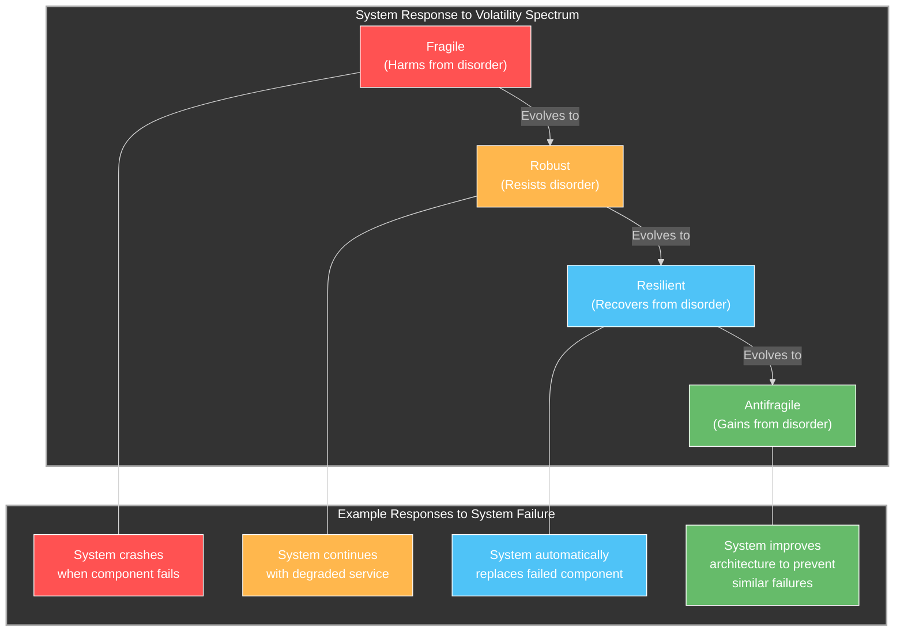

## Core Principles of Antifragile Design

Antifragile systems exhibit several key characteristics that distinguish them from merely resilient ones:

1. **Gains from Disorder** - The system improves through exposure to stressors
2. **Optionality** - Maintains multiple potential adaptation pathways
3. **Barbell Strategy** - Combines extreme risk aversion in critical areas with controlled risk-taking in others
4. **Via Negativa** - Simplifies by removing rather than adding complexity
5. **Skin in the Game** - Ensures decision-makers bear the consequences of their choices
6. **Convex Tinkering** - Small experiments with limited downside but potential large upside
7. **Redundancy** - Not just as backup but as a source of diversity and options
8. **Decentralization** - Distributing power and decision-making
9. **Non-linear Responses** - Capability to generate outsized positive responses to stressors

Let's examine how the Fidelity framework embodies these principles.

## Antifragile Elements in the Fidelity Framework

### 1. Gains from Disorder: The "Let It Fail" Philosophy

Most traditional software systems attempt to prevent failures. The Fidelity framework, like Erlang before it, embraces a "let it fail" philosophy that transforms failures into opportunities for learning and improvement.

```mermaid
%%{init: {'theme': 'dark', 'themeVariables': { 'primaryColor': '#242424', 'primaryTextColor': '#fff', 'primaryBorderColor': '#888', 'lineColor': '#d3d3d3', 'secondaryColor': '#2b2b2b', 'tertiaryColor': '#333' }}}%%
flowchart TD
    subgraph Traditional["Traditional Error Handling"]
        TP["Prevent Errors\nAt All Costs"]
        TC["Complex Error\nPrevention Logic"]
        TF["System-Wide Failure\nWhen Prevention Fails"]
    end
    
    subgraph Antifragile["Antifragile Error Handling"]
        AP["Accept That\nErrors Will Happen"]
        AS["Supervision Hierarchies\nContain Failures"]
        AL["Learn From Failures\nAutomatic Adaptation"]
    end
    
    TP --> TC --> TF
    AP --> AS --> AL
    
    style Traditional fill:#333,stroke:#aaa,stroke-width:2px,color:#fff
    style Antifragile fill:#333,stroke:#aaa,stroke-width:2px,color:#fff
    style TP fill:#FF5252,stroke:#fff,stroke-width:1px,color:#fff
    style TC fill:#FF5252,stroke:#fff,stroke-width:1px,color:#fff
    style TF fill:#FF5252,stroke:#fff,stroke-width:1px,color:#fff
    style AP fill:#66BB6A,stroke:#fff,stroke-width:1px,color:#fff
    style AS fill:#66BB6A,stroke:#fff,stroke-width:1px,color:#fff
    style AL fill:#66BB6A,stroke:#fff,stroke-width:1px,color:#fff
```

The Olivier Actor Model within Fidelity implements sophisticated supervision strategies (OneForOne, OneForAll, RestForOne, Escalate) that allow the system to:

- Isolate failures to specific components
- Automatically restart failed components
- Escalate problems to appropriate supervision levels
- Learn from failure patterns to prevent future occurrences

The model includes bidirectional supervision between Olivier actors and potentially remote Akka.NET clusters:

```fsharp
/// Remote supervision decision process
let handleLocalFailure (failedActor: ActorRef) (exception: exn) (remoteSupervisor: ActorRef) =
    // Create failure notification
    let notification = RemoteFailureNotification(
                           ActorPath = failedActor.Path,
                           Exception = exception,
                           Timestamp = DateTimeOffset.UtcNow)
    
    // Send to remote supervisor
    let response = remoteSupervisor.Ask<RemoteSupervisionResponse>(notification)
    
    // Interpret and apply supervision decision
    match response.Decision with
    | Resume -> resumeActor failedActor
    | Restart -> restartActor failedActor
    | Stop -> stopActor failedActor
    | Escalate -> escalateFailure failedActor exception
```

Unlike traditional error handling that treats exceptions as edge cases to prevent, this approach treats failures as expected events that provide valuable information for system improvement.

### 2. Optionality: Functional Composition for Platform Configuration

Antifragile systems preserve options to adapt to changing conditions. The Fidelity framework uses functional composition for platform configuration, maintaining flexibility for adaptation:

```fsharp
// Custom transforms for a specific FPGA target
let fpgaTransforms = [
    PlatformConfig.withPlatform PlatformType.Embedded
    PlatformConfig.withMemoryModel MemoryModelType.Limited
    PlatformConfig.withVectorCapabilities VectorCapabilities.Extensive
    PlatformConfig.withHeapStrategy HeapStrategyType.CustomGC
    // FPGA-specific custom transforms
    withFPGAMemoryLayout
    withFPGAAccelerationUnits
]

// Create FPGA configuration
let fpgaConfig = PlatformConfig.compose fpgaTransforms PlatformConfig.base'
```

This compositional approach provides several antifragile characteristics:

- **Adaptation to unknown platforms**: New hardware can be supported through composition rather than architectural redesign
- **Progressive enhancement**: Capabilities can be added incrementally without disrupting existing systems
- **Reversibility**: Changes can be easily rolled back by removing transforms
- **Experimentation**: New configurations can be tested with minimal risk

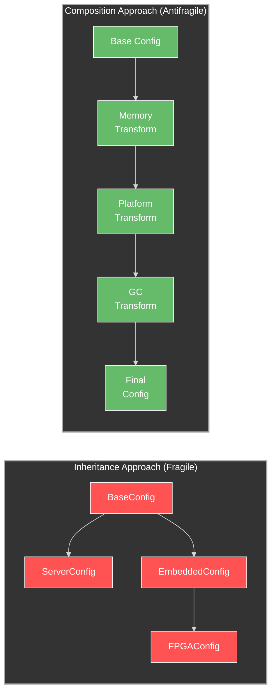

In an inheritance-based approach, adding new platform capabilities often requires extensive refactoring. The compositional approach preserves optionality by allowing the system to evolve in multiple directions simultaneously.

### 3. Barbell Strategy: Combining High-Level Safety with Low-Level Control

Taleb's barbell strategy involves combining extreme safety with controlled exposure to high-impact opportunities. The Fidelity framework implements this by bridging high-level F# abstractions with direct access to low-level operations:

```fsharp
// Define a simple vector operation using LicenseToMLIR
open LicenseToMLIR
open LicenseToMLIR.Types

// Create a function that adds two 4D vectors using MLIR vector operations
// Type implementation adapts based on target platform configuration
let addVectors (a: Vector4<float>) (b: Vector4<float>) =
    mlir {
        // Load the vectors
        yield! loadVector a
        yield! loadVector b
        
        // Generate vector.add operation
        yield mlir_vector_add VectorType.Float32x4
        
        // Return the result
        yield ret
    }
```

This example shows the barbell approach in action:
- **Safe side**: Strong F# type system and high-level abstractions
- **Opportunity side**: Direct MLIR code generation for maximum performance

The LicenseToMLIR framework bridges these two extremes, allowing developers to operate safely most of the time while preserving the ability to optimize critical paths directly:

```mermaid
%%{init: {'theme': 'dark', 'themeVariables': { 'primaryColor': '#242424', 'primaryTextColor': '#fff', 'primaryBorderColor': '#888', 'lineColor': '#d3d3d3', 'secondaryColor': '#2b2b2b', 'tertiaryColor': '#333' }}}%%
flowchart LR
    subgraph HighLevel["Safe Side: High Level"]
        FSharp["F# Type System"]
        FP["Functional Composition"]
        Type["Type Safety & Inference"]
    end
    
    subgraph Bridge["Bridge Layer"]
        MLIR["MLIR Generation"]
        Parser["XParsec"]
        UMX["FSharp.UMX"]
    end
    
    subgraph LowLevel["Opportunity Side: Low Level"]
        Metal["Bare Metal Access"]
        Opt["Performance Optimization"]
        WASM["Direct WebAssembly"]
    end
    
    HighLevel <--> Bridge <--> LowLevel
    
    style HighLevel fill:#333,stroke:#aaa,stroke-width:2px,color:#fff
    style Bridge fill:#333,stroke:#aaa,stroke-width:2px,color:#fff
    style LowLevel fill:#333,stroke:#aaa,stroke-width:2px,color:#fff
    style FSharp fill:#66BB6A,stroke:#fff,stroke-width:1px,color:#fff
    style FP fill:#66BB6A,stroke:#fff,stroke-width:1px,color:#fff
    style Type fill:#66BB6A,stroke:#fff,stroke-width:1px,color:#fff
    style MLIR fill:#4FC3F7,stroke:#fff,stroke-width:1px,color:#fff
    style Parser fill:#4FC3F7,stroke:#fff,stroke-width:1px,color:#fff
    style UMX fill:#4FC3F7,stroke:#fff,stroke-width:1px,color:#fff
    style Metal fill:#FF5252,stroke:#fff,stroke-width:1px,color:#fff
    style Opt fill:#FF5252,stroke:#fff,stroke-width:1px,color:#fff
    style WASM fill:#FF5252,stroke:#fff,stroke-width:1px,color:#fff
```

This barbell approach applies across multiple layers:

- **Memory management**: Safe F# reference semantics with precision control via UMX units of measure
- **Concurrency**: High-level timeline signals with direct access to low-level actor scheduling
- **UI**: Declarative Elmish MVU cycle with direct LVGL rendering control
- **Compilation**: F# source code with direct control over LLVM optimization passes

### 4. Via Negativa: Simplification Through Removal

The Fidelity framework's Hybrid Process-Actor Memory Model exemplifies the via negativa principle by removing the unnecessary complexity of per-actor heaps (as found in Erlang):

```fsharp
/// OS Process as the primary isolation boundary
type OlivierSystemProcess = {
    /// Operating system process identifier
    OsPid: int
    
    /// OS process-wide shared memory pool (managed by SGen)
    SharedHeap: SGenManagedHeap
    
    /// Actors executing within this OS process
    Actors: Map<ActorId, ActorState>
    
    /// Scheduler for actors within this process
    Scheduler: ActorScheduler
    
    /// Supervision strategy for process-level failures
    SupervisorStrategy: SupervisionStrategy
}
```

By removing per-actor heaps in favor of process-wide shared heaps, the framework:

- Simplifies memory management
- Reduces fragmentation
- Enables zero-copy message passing within processes
- Reduces GC overhead

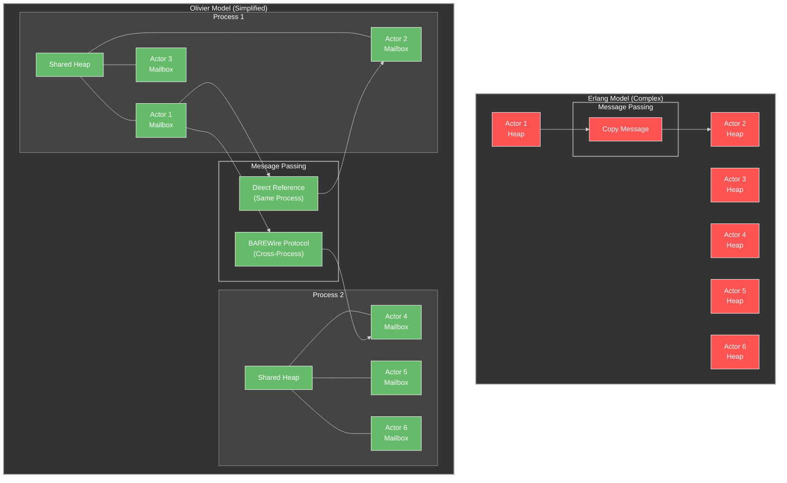

This simplification allows the system to:
- Scale more efficiently with large numbers of actors
- Reduce memory overhead
- Improve locality for related actors
- Minimize garbage collection pauses

### 5. Skin in the Game: Local Responsibility for Failure

The Fidelity framework embodies Taleb's "skin in the game" principle by ensuring that components dealing with specific operations also handle the failures of those operations:

```fsharp
/// Erlang-inspired supervision for local fault tolerance
type SupervisionStrategy =
    | OneForOne       // Restart only the failed actor (from Erlang)
    | OneForAll       // Restart all actors in the group (from Erlang)
    | RestForOne      // Restart failed actor and those that depend on it (from Erlang)
    | Escalate        // Pass failure to parent supervisor (common pattern in Erlang)
```

Instead of remote error handling, the system assigns direct responsibility for error management close to where errors occur:

- Actors supervise their child actors directly
- Supervised trees allow failures to propagate in controlled patterns
- Failure data remains close to its source for efficient analysis

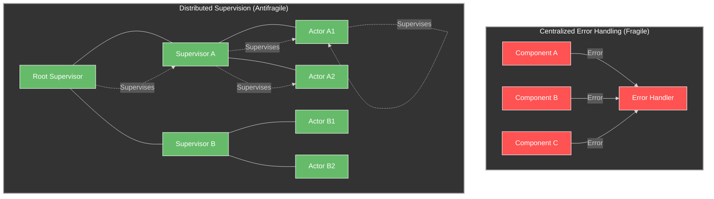

### 6. Convex Tinkering: Experimental Optimizations with Limited Downside

The MLIR integration in Fidelity exemplifies convex tinkering by enabling small, experimental optimizations with limited downside but potentially significant performance benefits:

```fsharp
/// MLIR optimization passes
module MLIROptimizer =
    /// Optimization level
    type OptimizationLevel =
        | O0  // No optimization
        | O1  // Basic optimization
        | O2  // Medium optimization
        | O3  // Aggressive optimization
    
    /// Apply optimization passes to an MLIR module
    let applyOptimizationPasses (context: MLIRContext) (module: MLIRModule) (level: OptimizationLevel) : unit =
        // Create pass manager
        use passManager = context.CreatePassManager()
        
        // Add passes based on optimization level
        match level with
        | O0 -> 
            // No optimization
            ()
            
        | O1 ->
            // Basic optimizations
            passManager.AddPass(context.CreateCanonicalizerPass())
            passManager.AddPass(context.CreateCSEPass())
            
        | O2 ->
            // Medium optimizations
            passManager.AddPass(context.CreateCanonicalizerPass())
            passManager.AddPass(context.CreateCSEPass())
            passManager.AddPass(context.CreateMemRefDataFlowOptPass())
            passManager.AddPass(context.CreateSCCPPass())
            
        | O3 ->
            // Aggressive optimizations
            passManager.AddPass(context.CreateCanonicalizerPass())
            passManager.AddPass(context.CreateCSEPass())
            passManager.AddPass(context.CreateMemRefDataFlowOptPass())
            passManager.AddPass(context.CreateSCCPPass())
            passManager.AddPass(context.CreateLoopFusionPass())
            passManager.AddPass(context.CreateLoopUnrollPass())
            passManager.AddPass(context.CreateAffineLoopTilingPass())
            passManager.AddPass(context.CreateVectorizePass())
```

This approach provides:
- Controlled experimentation with optimization techniques
- Ability to test performance impacts incrementally
- Limited blast radius for optimization failures
- Potential for significant performance improvements with minimal risk

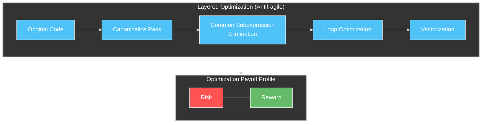

The diagram illustrates how optimization passes have a convex payoff profile—limited downside risk (worst case is code that still works but isn't faster) but potentially significant upside (major performance improvements).

### 7. Redundancy: Multi-Level Isolation and Replication

The Olivier Actor Model implements redundancy not simply as a backup mechanism but as a source of diversity and options:

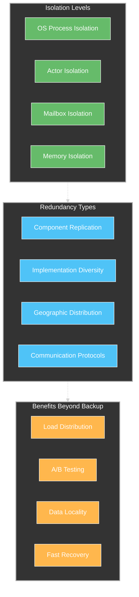

The Fidelity framework implements redundancy with these characteristics:

- **Multi-level isolation**: OS processes, actors, mailboxes, and memory all provide different isolation levels
- **Built-in replication**: Cluster sharding for distributed redundancy
- **Multiple communication paths**: Direct references, BAREWire protocol, cross-process messaging
- **Benefits beyond backup**: Load distribution, A/B testing capability, data locality

When combined with supervision strategies, this multi-layered redundancy enables the system to:
- Survive multiple concurrent failures
- Experiment with different implementations
- Adapt to changing workloads
- Recover quickly from faults

### 8. Decentralization: Distributed Decision-Making

The Actor model inherently supports decentralization, distributing decision-making across many autonomous components:

```fsharp
/// Akka.NET-compatible sharding API
module Sharding =
    /// Initialize sharding for an entity type
    let start (system: ActorSystem) (typeName: string) (entityProps: string -> Props) (settings: ShardingSettings) =
        // Start sharding region
        let shardRegion = ClusterSharding.Start(
            system,
            typeName,
            entityProps,
            settings)
        
        shardRegion
    
    /// Send message to sharded entity
    let send (shardRegion: ActorRef) (entityId: string) (message: obj) =
        // Construct sharding envelope
        let envelope = ShardingEnvelope(entityId, message)
        
        // Send via shard region
        shardRegion.Tell(envelope)
```

This decentralization creates a system where:
- Decision-making is distributed across actors
- Components operate autonomously
- No single component has complete knowledge or control
- State is partitioned and distributed

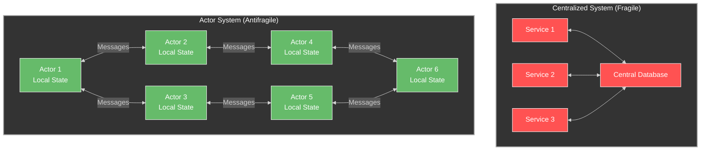

The advantages of this decentralized approach include:

- **Scalability**: The system can grow by adding more actors without central bottlenecks
- **Resilience**: Failure of any component affects only a subset of the system
- **Adaptability**: Components can evolve independently
- **Reduced coordination costs**: Actors only need to understand their specific domain

### 9. Non-linear Responses: Pattern Recognition and Optimization

Antifragile systems can respond non-linearly to inputs, potentially generating outsized positive responses to stressors. The Fidelity framework's pattern recognition capabilities enable this kind of response:

```fsharp
/// Register a custom pattern matcher
let registerPatternMatcher (matcher: IPatternMatcher) =
    PatternRegistry.RegisterMatcher(matcher)

/// Custom pattern matcher for vector operations
let vectorDotProductMatcher = {
    new IPatternMatcher with
        member this.TryMatch(node) =
            // Pattern matching logic
            ...
            
        member this.GenerateMLIR(patternMatch) =
            // MLIR generation logic
            ...
}
```

By recognizing patterns in code and automatically optimizing them, the system can:

- Transform naive implementations into highly optimized versions
- Turn linear performance into superlinear improvements
- Adapt code generation to specific hardware capabilities
- Learn from usage patterns to improve future performance

```mermaid
%%{init: {'theme': 'dark', 'themeVariables': { 'primaryColor': '#242424', 'primaryTextColor': '#fff', 'primaryBorderColor': '#888', 'lineColor': '#d3d3d3', 'secondaryColor': '#2b2b2b', 'tertiaryColor': '#333' }}}%%
flowchart LR
    subgraph Input["Input Code"]
        StandardLoop["Standard\nVector Loop"]
    end
    
    subgraph PatternRecognition["Pattern Recognition"]
        Analyze["Analyze Pattern"]
        Match["Match Known Patterns"]
        Select["Select Optimization"]
    end
    
    subgraph Output["Optimized Output"]
        SIMD["SIMD\nInstructions"]
        GPU["GPU Kernel"]
        Vectorized["Auto-vectorized\nLoop"]
    end
    
    Input --> PatternRecognition
    
    PatternRecognition --> Output
    
    style Input fill:#333,stroke:#aaa,stroke-width:2px,color:#fff
    style PatternRecognition fill:#333,stroke:#aaa,stroke-width:2px,color:#fff
    style Output fill:#333,stroke:#aaa,stroke-width:2px,color:#fff
    style StandardLoop fill:#4FC3F7,stroke:#fff,stroke-width:1px,color:#fff
    style Analyze fill:#4FC3F7,stroke:#fff,stroke-width:1px,color:#fff
    style Match fill:#4FC3F7,stroke:#fff,stroke-width:1px,color:#fff
    style Select fill:#4FC3F7,stroke:#fff,stroke-width:1px,color:#fff
    style SIMD fill:#66BB6A,stroke:#fff,stroke-width:1px,color:#fff
    style GPU fill:#66BB6A,stroke:#fff,stroke-width:1px,color:#fff
    style Vectorized fill:#66BB6A,stroke:#fff,stroke-width:1px,color:#fff
```

This creates a non-linear response profile where small stressors (performance bottlenecks) can trigger large-scale optimizations across the system.

## Implementing Antifragile Design Principles in Organizations

### Cultural Dimensions for Antifragile Software Development

The technical aspects of antifragility in the Fidelity framework are complemented by organizational practices that enable antifragile development:


Key practices include:

1. **Randomized testing and chaos engineering**: Deliberately introducing stressors to uncover weaknesses
2. **Blameless postmortems**: Focusing on learning from failures rather than assigning blame
3. **Safe-to-fail experiments**: Creating environments where failure is acceptable and expected
4. **Small, autonomous teams**: Enabling local decision-making and rapid adaptation
5. **Learning organization**: Systemic knowledge sharing and continuous improvement

### Designing for the Unknown Unknown

The most powerful aspect of antifragile design is preparing for the "unknown unknown" - conditions and challenges that cannot be anticipated:

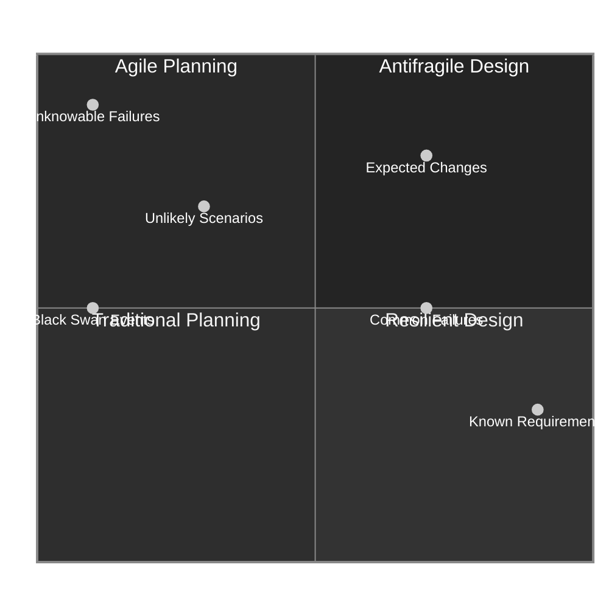

The Fidelity framework's design anticipates the unknown by:

1. **Minimizing critical assumptions**: Through functional composition, it avoids hard-coding assumptions about environments
2. **Enabling local adaptation**: The actor model allows components to adapt to changing conditions independently
3. **Building in learning mechanisms**: Supervision hierarchies capture and learn from failure patterns
4. **Creating optionality**: Multiple target platforms and memory models offer adaptation paths for future requirements

## Conclusion: Beyond Resiliency to Thriving Through Disorder

The Fidelity framework demonstrates that software systems can move beyond mere resilience to true antifragility. By embracing principles like optionality, decentralization, and convex tinkering, it creates a system that can actually improve through exposure to stressors and volatility.

The key insight is that antifragile software design doesn't just tolerate failure—it harnesses it as a driver of improvement. The functional-first approach of F# combined with the ability to "go to the metal" creates a barbell strategy that combines safety with opportunity, while the actor model and supervision hierarchies transform potentially destructive failures into constructive learning experiences.

Organizations seeking to build truly robust software systems should consider these principles of antifragile design, recognizing that the path to long-term stability paradoxically requires embracing volatility and designing systems that gain from disorder rather than merely surviving it.
